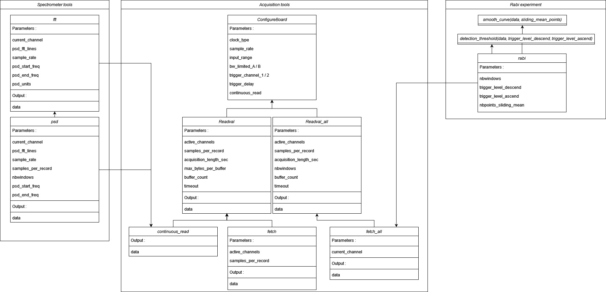
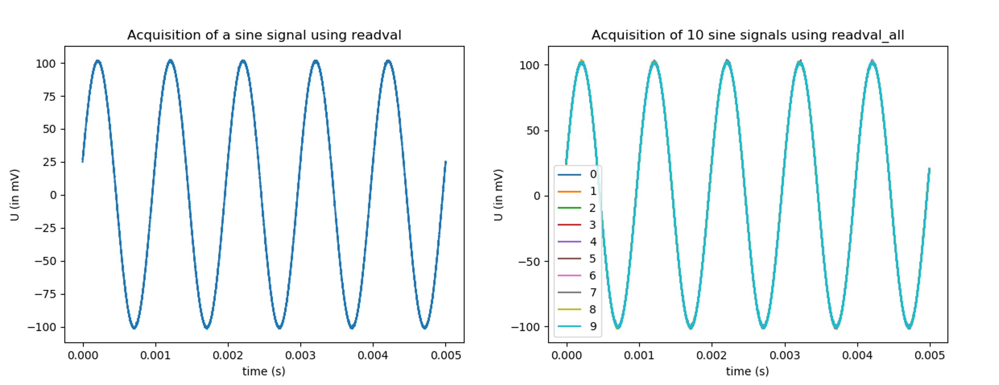

Alazartech Acquisition card
***************************

Introduction
============

Card developed by Alazartech for the acquisition of signals: `Alazartech website <https://www.alazartech.com/en/product/ats9462/13/>`_.
It is used to acquire signals, and to analyse them to perform FFT, PSD or a Rabi experiment.

Installation 
============

The code for the control of Alazartech acquisition cards is part of PyHegel, to be installed following the instructions on `PyHegel repository <https://github.com/lupien/pyHegel/blob/master/README.rst>`_.
The code is in the :mod:`instruments` module of PyHegel, under the name 'Alazartech.py'. 
You can detect all the Alazartech acquisition cards connected with the computer using the :py:func:`find_all_Alazartech` function.

>>> instruments.find_all_Alazartech()

If cards are connected together, they form a system. The function returns a dictionary having for keys the labels of the system and for values a tuple with the number of cards in the system and a new dictionary with keys the labels of the card in the system and values the main information about the card.
All cards are represented by the id number of their system and their id in this system. You can connect with any cards detected using :py:func:`instruments.find_all_Alazartech()` by using the function :py:func:`instruments.ATSBoard(systemId=1, boardId=1)`

>>> ats = instruments.ATSBoard()

In our case, we have only one card Alazartech, so its systemId and boardId are both equal to 1. If no cards are detected using :py:func:`instruments.find_all_Alazartech`, the installation of the card should be checked. First, check if the card is correctly wired on the computer, then check if its pilots are well installed and finally if the SDK version should not be updated. Information about the installation of the card is found on the Alazartech website, and information about the version of the SDK and Driver are obtained using :py:func:`instruments.find_all_Alazartech`. 

.. _Alazartech Overview:

Overview of the functionalities
===============================
Working with PyHegel
--------------------

From the iPython interface of PyHegel, you can create an Alazartech card ``instrument`` using :py:func:`instruments.ATSBoard`. This instrument is an instance of the Python class :class:`instruments.ATSBoard`. In this instance, some ``devices`` are defined, that are interactive attributes of the instrument. In the following, all the ``devices`` of :py:func:`instruments.ATSBoard` are written as :class:`device`. The minimum function of ``devices`` is to store data. The value of a ``device`` :class:`device` is obtained via its method :py:func:`get`. The :py:func:`get` method is defined in pyHegel and has many features, including the possibility to write the data in a file by defining a filename in the ``filename`` option. The file is saved in the ".txt" format, but it can be saved in another format by defining it in the ``bin`` option. See PyHegel documentation, run ``get?`` or ``get??`` in the PyHegel console to see the get options. Generally speaking, you can access the description of any ``device`` by running ``device?`` and see the source code of the device by running ``device??``.

>>> ats = instruments.ATSBoard()  # ats is an instrument 
>>> ats.acquisition_length_sec.get()  # print the value of the device acquisition_length_sec
>>> get ats.acquisition_length_sec, filename="acquisition_length_sec.txt"  # print the value of the device acquisition_length_sec and store it in a .txt file
>>> ats.acquisition_length_sec?  # see documentation associated with device acquisition_length_sec

All the devices and their value can be obtained by running :py:func:`ipython`. The value of certain devices can be changed interactively using the :py:func:``set`` method.

>>> set ats.acquisition_length_sec, 1e-3  # device acquisition_length_sec now stores the value 1e-3
>>> ats.acquisition_length_sec.set(1e-3)  # same operation

.. _Alazartech Overview Function:
Devices and functionalities of the card
---------------------------------------

The main functionality of the card is to acquire signals. Acquisition are of different types, see :ref:`the acquisition types<Alazartech acquisition types>`), and are defined by their duration :class:`acquisition_length_sec`, the number of points per acquisition :class:`samples_per_record` and the sample rate :class:`sample_rate`. You can acquire up to two streams of data and trigger using these channels or an external signal (see :ref:`acquisition ports<Alazartech acquisition types>`). The acquisitions are performed as on an oscilloscope and you need to define the size of the screen with :class:`input_range`, and the mode of the screen with :class:`acquisition_mode`. You can also modify some :ref:`inner parameters of the acquisition<Alazartech acquisition inner>`.

The card can also be used to post-process signals. The FFT or the PSD of any acquired signal can be made using :py:func:`instruments.ATSBoard.make_fft` or :py:func:`instruments.ATSBoard.make_psd`. The FFT or the PSD of a channel defined in :class:`current_channel` can be directly performed using :class:`fft` or :class:`psd`. The main parameters for these post-processing are the number of points taken to perform FFT :class:`psd_fft_lines`, the sample rate, the unit of the output :class:`psd_units` and the starting and ending frequencies at which the FFT/PSD should be shown, :class:`psd_start_freq` and :class:`psd_end_freq`.

It can also be used to analyse the results of a Rabi experiment using :class:`rabi`. After acquiring :class:`nbwindows` acquisitions, :py:func:`instruments.ATSBoard.detection_threshold` detects the times at which the signal crosses a threshold in a descending or ascending way (:class:`trigger_level_descend` and :class:`trigger_level_ascend`). It is possible to smooth curves using a sliding mean method involving :class:`nbpoints_sliding_mean` points with :py:func:`instruments.ATSBoard.smooth_curve`. 

.. _Alazartech Acquisition:
Acquiring signals
=================

.. _Alazartech Acquisition ports:
Acquisition ports
-----------------

On the back of the Alazartech card, 5 ports can be connected with coaxial cables. 

* The ports ``CHA`` & ``CHB`` acquire signals on Channel A and Channel B.
* the port ``TRIG IN`` is to receive a signal used to trigger acquisition of channel A and/or B.
* the ``AUX I/O`` port is to synchronize instruments by either supplying a 5V TTL-level signal or receiving a TTL-level input signal.   
* the ``ECLK`` port is to acquire signals on channel A and/or B with a sample rate between 150 and 180 MHz in 1MHz step by receiving.  

It is possible to acquire either channel A or channel B or both of them. The device :class:`active_channels` defines a list of the channels to acquire. For each channel to acquire, :class:`trigger_channel_1` and :class:`trigger_channel_2` defines which port to use as a reference for the trigger operation, and :class:`trigger_level_1` and :class:`trigger_level_2` stores the level at which to trigger in mV. The acquisition can start when the signal reaches the trigger level in an ascending or descending way, which is defined in :class:`trigger_slope_1` and :class:`trigger_slope_2`.

The internal clock of Alazartech cards enables the acquisitions to be performed only for certain sample rates. These sample rates depend on the acquisition card, but they range from 1KS/s to 4GS/s for the best cards. You can choose between using an internal clock ``INT`` and an external clock ``EXT`` by defining :class:`clock_type`.  

The ``AUX I/O`` port can be configured using :class:`aux_io_mode` and :class:`aux_io_param`.

.. image:: images/Alazartech/alazartech-ports.png
   :width: 600

.. _Alazartech acquisition types:
Acquisition types
-----------------

Three types of acquisition can be performed.

* :py:func:`readval.get` performs a trigger operation: it acquires the signal for a duration :class:`acquisition_length_sec` at a sampling rate :class:`sampling_rate` when the signal reaches a threshold current. :py:func:`fetch.get` works similarly. If an acquisition has already been performed for the channels defined in :class:`active_channels`, it simply outputs the result of this acquisition. Otherwise, :py:func:`fetch.get` calls :py:func:`readval.get`.
* :py:func:`readval_all.get` performs several trigger operation faster than by repeating :py:func:`readval.get`. The number of acquisitions is defined by device :class:`nbwindows` and the channels to acquire are defined by :class:`active_channels`. The function :py:func:`fetch_all.get` works similarly, except it only gets data for one channel, the :class:`current_channel`. :class:`nbwindows` is set to :math:`\lfloor \sqrt{n} \rfloor (\lfloor \sqrt{n} \rfloor + 1)` if is not a square. 
* :py:func:`continuous_read.get` acquires a signal right after being called. It calls :py:func:`readval.get` but with a :class:`trigger_mode` set to ``Continuous`` instead of ``Triggered``.

The sampling rate, the acquisition time and the number of points per records are related as :math:`sample\_rate * acquisition\_per\_second = samples\_per\_record`. :class:`sample_rate` can only take some values, and a finer control can be obtained by using the ``ECLK`` port. Changing the sample rate impacts the number of samples per record without changing the duration of the acquisition. Changing the duration of the acquisition also impacts the number of samples per record without changing the sample rate.

>>> ats = instruments.ATSBoard()
>>> set ats.trigger_level_1, 0
>>> set ats.sample_rate, 10e6
>>> set ats.acquisition_length_sec, 5e-3
>>> data = ats.readval.get()
>>> plot(data[0], data[1])

>>> set ats.nbwindows, 10
>>> data = ats.readval_all.get()
>>> for i in range(10):
...     plot(data[0], data[i+1])

>>> set ats.acquisition_length_sec, 1
>>> get ats.continuous_read

.. image:: images/Alazartech/continuous_read_long.png
   :width: 600

.. _Alazartech acquisition inner:
Structure of an acquisition
---------------------------

Before actually performing the acquisition, some operations have to be realized. The card should first be configured, which means that the :class:`sample_rate`, the :class:`clock_type` used for the sampling, the size of the screen :class:`input_range`, the delay to trigger :class:`trigger_delay` should be provided to the card, alongside information about the ports ``AUX I/O`` (:class:`aux_io_modes` and :class:`aux_io_param`), channel ``A`` (channel 1) and ``B`` (channel 2), that are the channel used to trigger :class:`trigger_channel_1`/:class:`trigger_channel_2` , the level at which to trigger :class:`trigger_level_1`/:class:`trigger_level_2`, the slope for which to trigger (for an ascending or descending signal) :class:`trigger_slope_1` and :class:`trigger_slope_2`, and the limit of the bandwith :class:`bw_limited_A`/:class:`bw_limited_B`. This configuration is performed in :py:func:`instruments.ATSBoard.ConfigureBoard`. When calling this function, the board is configured if the parameters have never been provided to the card or if one parameter was modified since the previous configuration (the inner attribute of the card ``_boardconfigured`` stores this data). This function is called at the begining of all the acquisition functions.    

Once configured, the card performs an acquisition by filling DMA Buffers in its inner memory. The number of these DMA Buffers can be changed with the device :class:`buffer_count`. In the Alazartech guide, it is adviced to have more than 2 DMA Buffers, and that having more than 10 DMA Buffers seem unnecessary. These DMA Buffers are defined by the number of bytes they contain. This number of bytes per DMA Buffer is derived from the number of samples per record :class:`samples_per_record`, the maximum number of bytes per buffer :class:`max_bytes_per_buffer`, the number of :class:`active_channels` and the number of bytes per sample (defined in the attribute ``board_info`` with the key "BytesPerSample"). 

In :class:`readval_all`, the number of trigger operations to perform (defined in :class:`nbwindows`) is redefined such that there is :math:`\lfloor\sqrt{nbwindows}\rfloor` records in each of the :math:`\lfloor\sqrt{nbwindows}\rfloor` buffers if the value of :class:`nbwindows` is a square (:math:`\lfloor\sqrt{nbwindows}\rfloor+1` buffers otherwise). Another condition for this device to work is that the value of :class:`samples_per_record` should be a multiple of 128.    

During an acquisition, the DMA Buffers are filled one after another and emptied in the same order in a dictionary ``data`` having keys the time ``t``, and the channels ``A`` and ``B``. This way, it is possible to use more buffers than the number of DMA Buffers. The acquisition is performed by the function :py:func:`waitAsyncBufferComplete`, that takes as parameter the address of the DMA Buffer to fill and a time after which to stop the acquisition, defined in the device :class:`timeout`.

At the end of an acquisition, the data is re-written in an array with first column ``t``, and second and/or third column ``A`` and/or ``B`` (depending on the :class:`active_channels`). This way the data can be directly written in a file using the :py:func:`get` of PyHegel.

.. _Alazartech PSD:
Performing the PSD/FFT of a Signal:
===================================

Fast Fourier Transform
----------------------

The Fast Fourier Transform (FFT) of a signal having first column the time and second column the voltages of a signal can be performed using :py:func:`instruments.ATSBoard.make_fft`. The number of frequency points at which the FFT is computed is always equal to :class:`samples_per_record`. It is described by another variable in order not to mix the temporal and frequency acquisitions :class:`psd_fft_lines`. A FFT acquisition is also defined by :class:`psd_linewidth`, that is, the frequency difference between two frequencies at which the FFT is computed. This quantity is the inverse of the duration of the acquisition (in seconds). With these two parameters the FFT is computed for frequencies ranging from 0 to :math:`\frac{sample\_rate}{2}` (Nyquist criteria).

It is possible to ask for only a part of the FFT to be shown by modifying the range of the frequencies :class:`psd_span`. If this range is smaller than :math:`\frac{sample\_rate}{2}`, it is possible to define the :class:`psd_start_freq`, :class:`psd_center_freq` or :class:`psd_end_freq` (one defines the other as :math:`f_{end} = f_{start}+f_{span}` and :math:`f_{end} = f_{center}+\frac{f_{span}}{2}`) such that only the frequencies between :class:`psd_start_freq` and :class:`psd_end_freq` are shown. The values of these devices should always be such that :math:`f_{end} \leq \frac{sample\_rate}{2}`.

The units the FFT acquisition should be displayed can be in ``V`` or in ``dBV``, and should be defined in :class:`psd_units`. The device :class:`fft` acquires a signal from :class:`current_channel` and calls :py:func:`make_fft`. If the value of :class:`psd_units` is not ``V`` or ``dBV`` it is set to ``V`` when calling  :py:func:`make_fft`. :class:`make_psd` calls :py:func:`make_fft` if :class:`psd_units` is ``V`` or ``dBV``. Analogously :class:`psd` acquires a signal from :class:`current_channel` and performs the psd by calling :py:func:`make_fft` if :class:`psd_units` is ``V`` or ``dBV``.

.. image:: images/Alazartech/fft.png
   :width: 600

.. image:: images/Alazartech/psd.png
   :width: 600

Power Spectral Density
----------------------

The Power Spectral Density (PSD) of a signal is computed in :py:func:`instruments.ATSBoard.make_psd`, if the units defined in :class:`psd_units` are defined as PSD units (``V**2``, ``V**2/Hz``, ``V/sqrt(Hz)``). The Welch method is used. 

* The acquisition is cut in :class:`nbwindows` of :math:`\lfloor\frac{NbSamples}{NbWindows}\rfloor` points.
* Each sub-acquisition is multiplied by a :class:`window_function`.
* Take the FFT of each result (number of points for the FFT defined by :class:`psd_fft_lines`, under the condition that it is lower or equal to :math:`\lfloor\frac{NbSamples}{NbWindows}\rfloor`.
* Take the average of the square of FFTs. Output the data if the value of :class:`psd_units` is ``V**2``.
* Divide by the bandwith to obtain units in ``V**2/Hz``. Take the square root of the result to obtain units in ``V/sqrt(Hz)``.

.. _Alazartech Rabi
Performing a Rabi experiment
============================

Description of a Rabi experiment
--------------------------------

A Rabi experiment is composed of three stages. First, the gate voltage is high such that we are sure we load the quantum dot with an electron. After a long time, the atom is in its ground state. A microwave pulse of frequency :math:`\omega` interacts with the electron during a time :math:`t_{Rabi}` such that the electron is in its excited state with probability :math:`\cos(\omega t_{Rabi})^2`. During a second stage, we stop the microwave pulse and lower the gate voltage so that the energy of the electron is between the ground and excited state. If it is in the ground state, no current will be measured during this phase. If it is in the excited state, a current will be measured. During a third stage, the gate voltage is set low such that the electron is definitely out of the box. The whole experiment consists in repeating these three steps many times for various duration of the microwave pulse. For each :math:`t_{Rabi}`, we compute the number of acquisitions in which a current drop was measured and divide it by the number of iterations.

Acquiring a Rabi experiment
---------------------------

The :class:`rabi` device performs :class:`nbwindows` acquisitions of the :class:`current_channel` one after another using :class:`fetch_all`. Afterwards, these acquisitions are analyzed to extract the times at which the voltage goes above :class:`threshold_level_ascend` or below :class:`threshold_level_descend`. This extraction is performed by :py:func:`instruments.ATSBoard.detection_threshold`. It is possible to smooth the signal using a sliding mean filter :py:func:`instruments.ATSBoard.smooth_curve` before the detection of the thresholds. The number of points taken for the sliding mean is defined in :class:`sliding_mean_points`. If this number is 0, then the detection is directly performed on the signal.  

Tests & Performances
====================

The time duration of any command on PyHegel can be computed by writing ``%time`` before the command. This way we measure the duration of the various acquisition tools (mean over 100 calls).

.. list-table:: Time duration of some acquisition tools (mean over 100 calls)
   :widths: 25 50 25 25
   :header-rows: 1

   * - :class:`readval`, acquisition_length_sec=5e-3
     - :class:`readval_all`, acquisition_length_sec=5e-3, nbwindows=100
     - :class:`continuous_read`, acquisition_length_sec=5e-3
     - :class:`continuous_read`, acquisition_length_sec=1
   * - 0.16s
     - 10.58s
     - 0.182s
     - 1.43s

It can be noticed that it is faster to call :class:`readvall_all` with :class:`nbwindows` set to 100 (takes 10.58s) than to call :class:`readval` 100 times (takes 16s). The post-processing doesn't take much more time.

.. list-table:: Time duration of some post-processing tools, for a sample rate of 10MHz
   :widths: 25 25 50 50
   :header-rows: 1

   * - :class:`rabi`, acquisition_length_sec=5e-3, nbwindows=100, sliding_mean_points=0
     - :class:`rabi`, acquisition_length_sec=5e-3, nbwindows=100, sliding_mean_points=10
     - :class:`fft`, acquisition_length_sec=1
     - :class:`psd`, acquisition_length_sec=1
   * - 10.59s
     - 10.60s
     - 1.69s
     - 2.10s
     
